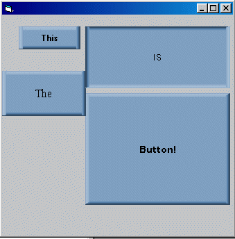



## ActiveX 3D Button

### Description

A Full working 3D Blue Button That you can use in anything, very simple, uses pictures not lines so its easier to understand

Please vote as i have taken time ot make this just so people around the world can use it for free, and then most people just click download and run it. And maybe use over and over again!! without even mentioning!!! :-@ !

Also please leave feedback so I can add more features to the control!

Thanks

Richard
 
### More Info
 

             |
---                |---
**Submitted On**   |2002-01-27 11:29:52
**By**             |[Richard Taylor](https://github.com/Planet-Source-Code/PSCIndex/blob/master/ByAuthor/richard-taylor.md)
**Level**          |Beginner
**User Rating**    |4.0 (20 globes from 5 users)
**Compatibility**  |VB 6\.0
**Category**       |[OLE/ COM/ DCOM/ Active\-X](https://github.com/Planet-Source-Code/PSCIndex/blob/master/ByCategory/ole-com-dcom-active-x__1-29.md)
**World**          |[Visual Basic](https://github.com/Planet-Source-Code/PSCIndex/blob/master/ByWorld/visual-basic.md)
**Archive File**   |[ActiveX\_3D513451272002\.zip](https://github.com/Planet-Source-Code/richard-taylor-activex-3d-button__1-31245/archive/master.zip)

